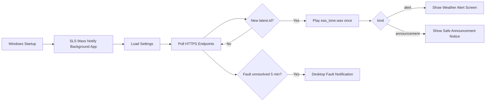

# SouthlandServers Mass Notification App

**Current version: V1.0.1**

[](#install)
[](#build-from-source)
[](LICENSE)
[](https://southlandservers.xyz/projects)

SouthlandServers Mass Notification App is an open-source Windows desktop companion for SIP NOTIFY, emergency alert, PBX announcement, and EAS-style visual notification workflows.

It runs quietly in the background, starts with Windows if enabled, polls one or more HTTPS endpoints, plays the bundled EAS tone for new events, and displays clean desktop alert windows without requiring users to keep a browser open.

[View Southland Servers Projects](https://southlandservers.xyz/projects)


## What It Does

| Area | Behavior |
| --- | --- |
| Weather alerts | Shows NWS/SIP NOTIFY-style alert screens with title, priority, severity, area, effective time, and until/expires time. |
| Announcements | Shows a simplified safe-format notice with a hazard icon, title, and body only. |
| Endpoints | Supports up to three independent HTTPS endpoints. |
| Tokens | Supports bearer tokens per endpoint, plus a `No token` mode for trusted direct endpoints. |
| Startup | Can register itself to run automatically when Windows starts. |
| Updates | Optional automatic update checks from GitHub Releases once every 24 hours. |
| Faults | Shows a desktop fault notification if an endpoint, token, or system issue remains unresolved for five minutes. |
| Uninstall | Adds a normal Windows uninstall entry and Start Menu uninstall shortcut. |

## Screens And Event Types

### Weather / NWS Alerts

Weather alerts use the structured weather fields returned by the API:

- `latest.title`
- `latest.priority`
- `latest.priority_label`
- `latest.severity`
- `latest.area`
- `latest.effective`
- `latest.expires`
- `latest.description`
- `latest.image_url`

Priority colors:

| Priority | Display Color |
| --- | --- |
| `critical` | Red |
| `urgent` | Orange |
| `advisory` / `notice` | Yellow |

### Mass Notify Announcements

Announcements use `latest.kind: "announcement"` and display only:

- hazard triangle/exclamation symbol
- title
- body text

The announcement window intentionally does not display endpoint internals, XML internals, IP addresses, recipients, or fake phone controls.

## Install

Download the latest V1.0.1 installer from the [GitHub Releases page](https://github.com/vipgabe09267/SouthlandServers_Mass_Notify_app/releases):

```text
SLS_Mass_Notify_Installer.exe
```

Run the installer as Administrator. The installer will:

1. Install the app into:

   ```text
   C:\Program Files\Southland Servers Group\SLS Mass Notify
   ```

2. Add Start Menu shortcuts under:

   ```text
   Southland Servers Group
   ```

3. Add a Windows Installed Apps uninstall entry.
4. Ask whether the app should run at Windows startup.
5. Ask whether automatic GitHub update checks should be enabled.
6. Launch the Settings window after install.

Windows SmartScreen may warn on unsigned builds. Code signing is recommended before broad public deployment.

## First Run Setup

When Settings opens, configure at least one endpoint.

1. Enable the endpoint tab you want to use.
2. Enter the HTTPS endpoint URL.
3. Enter the bearer token/key, or check `No token` if the endpoint is designed to be called directly.
4. Choose the poll interval.
5. Click `Test Active Endpoints`.
6. Click `Save`.

The app can monitor up to three endpoints at the same time. Each endpoint can have a different URL, token, enabled state, and no-token setting.

## How It Works

The background app polls each enabled endpoint on a timer.



For token-protected endpoints, the app sends a normal HTTPS `GET` request:

```http
GET /api/sipnotify?limit=25 HTTP/1.1
Host: example.com
Authorization: Bearer TOKENHERE
```

If `No token` is checked, the app calls the endpoint without the `Authorization` header.

The app stores the last seen `latest.id` for each endpoint. A notification appears only when that ID changes. If an endpoint does not provide an ID, the app falls back to a content fingerprint.

## Expected API Format

### Weather Alert Example

```json
{
  "ok": true,
  "latest": {
    "kind": "alert",
    "id": "urn:oid:...",
    "event": "Tornado Warning",
    "title": "TORNADO WARNING",
    "priority": "critical",
    "priority_label": "CRITICAL",
    "severity": "Extreme",
    "message_type": "Alert",
    "area": "Williamson County TX",
    "effective": "2026-06-21T08:27:32-05:00",
    "expires": "2026-06-21T09:12:32-05:00",
    "description": "The National Weather Service has issued...",
    "image_url": "https://example.com/nws_visual_push/alert_xxx.png",
    "xml": "<YealinkIPPhoneImageScreen ...>",
    "recipients": ["1000"],
    "created_at": "2026-06-21T08:27:32-05:00"
  },
  "events": []
}
```

### Announcement Example

```json
{
  "ok": true,
  "latest": {
    "kind": "announcement",
    "id": "announcement-20260621182234",
    "event": "Announcement",
    "title": "Announcement",
    "priority": "notice",
    "priority_label": "ADVISORY",
    "beep": "yes",
    "body": "Mass notify body verification test 2",
    "text": "Mass notify body verification test 2",
    "description": "Mass notify body verification test 2",
    "message": "Mass notify body verification test 2",
    "image_url": "",
    "xml": "<YealinkIPPhoneTextScreen Beep='yes'>...</YealinkIPPhoneTextScreen>",
    "recipients": [],
    "created_at": "2026-06-21T13:22:34.632063-05:00"
  },
  "events": []
}
```

## Security Notes

- Endpoint URLs should use `https://`.
- `http://` is accepted only for localhost or loopback development testing.
- Local tokens are encrypted with Windows DPAPI before being saved.
- Settings are stored under:

  ```text
  %APPDATA%\SouthlandServers\SLS_Mass_Notify\settings.json
  ```

- The exact XML payload remains available from the raw XML view, but the normal visible alert screens are driven by clean API fields.
- Server-side token storage at `/etc/nws_sipnotify_api.token`, 401 handling, Apache routing, and 256-bit token generation remain server responsibilities.

## Automatic Updates

Automatic updates are optional.

When enabled, the app checks this GitHub repository once every 24 hours:

```text
vipgabe09267/SouthlandServers_Mass_Notify_app
```

The updater watches GitHub Releases. When a newer published, non-draft release is available, the app downloads the release asset named:

```text
SLS_Mass_Notify_Installer.exe
```

Then it runs that installer in update mode. Because the app installs into Program Files, Windows may request administrator approval during updates.

## Uninstall

Use either method:

```text
Start Menu > Southland Servers Group > Uninstall SouthlandServers Mass Notification App
```

or:

```text
Windows Settings > Apps > Installed Apps
```

The uninstaller removes startup entries, Start Menu shortcuts, installed app files, and optionally saved endpoint settings/tokens.

## Build From Source

Install build requirements:

```powershell
py -m pip install -r requirements-build.txt
```

Build the standalone background app:

```powershell
.\build.ps1 -Clean
```

Output:

```text
dist\SLS_Mass_Notify.exe
```

Build the installable setup app:

```powershell
.\build-installer.ps1 -Clean
```

Output:

```text
dist\SLS_Mass_Notify_Installer.exe
```

## Release Checklist

Before publishing a release:

1. Confirm `APP_VERSION` is still `1.0.1` for this V1.0.1 release.
2. Rebuild with `.\build-installer.ps1 -Clean`.
3. Test install, settings save, endpoint test, background startup, alert display, announcement display, uninstall, and update preference.
4. Attach `dist\SLS_Mass_Notify_Installer.exe` to the GitHub Release.
5. Code sign the app and installer when a signing certificate is available.

## Project Status

V1.0.1 is suitable for controlled testing, demos, pilots, and small trusted deployments.

Recommended hardening before broad public production rollout:

- code signing and installer signing
- CI-based release builds
- automated endpoint integration tests
- crash reporting or stronger log rotation
- signed update verification

## License

This project is open source under the [GNU General Public License v3.0](LICENSE).

Contributions, forks, audits, and integrations are welcome under the same copyleft license terms.
